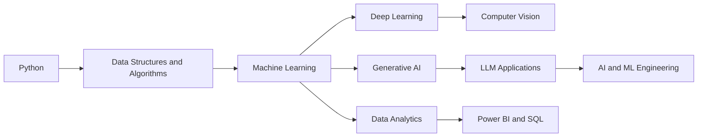

<div align="center">

# Hi 👋, I'm Mousom Koley

### Aspiring AI/ML Engineer • Python Developer • Data Analytics Enthusiast

<p>
  <a href="https://git.io/typing-svg">
    
  </a>
</p>

<p>
  <a href="mailto:koleymousom098@gmail.com">
    
  </a>

  <a href="https://www.linkedin.com/in/mousom-koley">
    
  </a>

  <a href="https://github.com/Mousam098">
    
  </a>
</p>


</div>

---

## 👨‍💻 About Me

I am a final-year **B.Tech Information Technology student** from Kolkata, India, with a strong interest in **Artificial Intelligence, Machine Learning, Python development, data analytics, computer vision, and Generative AI**.

My primary programming language is **Python**. I use Python for data analysis, exploratory data analysis, machine-learning workflows, API integration, automation, and application development.

I also work with **SQL, Power BI, Microsoft Excel, Flask, Streamlit, REST APIs, AWS, data annotation, computer vision, and Generative AI APIs**.

* 🔭 Currently working on **Python, AI/ML, data analytics, and Generative AI applications**
* 🌱 Learning **Machine Learning, DSA, DBMS, System Design, APIs, and Cloud Computing**
* 🤖 Exploring **LLMs, prompt engineering, AI automation, and API-based AI applications**
* 📊 Building skills in **Power BI, Excel, SQL, EDA, and business analytics**
* 👁️ Interested in **Computer Vision, LiDAR, object detection, and data annotation**
* 💼 Seeking opportunities in **AI/ML, Python development, data analytics, and software engineering**
* 🤝 Open to **open-source contributions, technical collaborations, and internship opportunities**
* 📍 Based in **Kolkata, West Bengal, India**
* 📫 Contact: **[koleymousom098@gmail.com](mailto:koleymousom098@gmail.com)**

---

## 🎯 Career Interests

<div align="center">


</div>

---

# 💻 Technical Skills

## 🐍 Programming Languages

<p align="center">
  
</p>

| Technology       | Knowledge                                                                        |
| ---------------- | -------------------------------------------------------------------------------- |
| **Python**       | Primary language for AI, machine learning, analytics, automation and development |
| **SQL**          | Database querying, joins, filtering, aggregation and data analysis               |
| **C and C++**    | Programming fundamentals and problem-solving                                     |
| **Java**         | Basic Java and object-oriented programming concepts                              |
| **JavaScript**   | Basic frontend logic and web application functionality                           |
| **HTML and CSS** | Webpage structure, styling and responsive interface fundamentals                 |

---

## 🤖 Artificial Intelligence and Machine Learning

<p align="center">
  
</p>

<div align="center">


</div>

### Areas of Knowledge

* Machine-learning fundamentals
* Supervised learning
* Regression and classification
* Data preprocessing
* Feature preparation
* Train-test splitting
* Model training and evaluation
* Exploratory Data Analysis
* Computer vision
* Image classification
* Object detection
* YOLO fundamentals
* Generative AI application development
* LLM API integration
* Gemini API integration
* Prompt engineering
* Output validation
* Human-in-the-Loop workflows
* Image annotation
* Bounding-box annotation
* Semantic-segmentation fundamentals
* Data validation and quality checking
* LiDAR technology and annotation fundamentals

---

## 📚 Python Libraries and Frameworks

<div align="center">


</div>

### Python Knowledge

* Python syntax and programming fundamentals
* Object-Oriented Programming
* Classes and objects
* Inheritance
* Polymorphism
* Encapsulation
* Abstraction
* Functions and modules
* File handling
* Exception handling
* List, set and dictionary comprehensions
* Data structures
* Data cleaning and transformation
* Exploratory Data Analysis
* Machine-learning workflows
* API integration
* Automation scripts

---

## 📊 Data Analytics and Business Intelligence

<div align="center">


</div>

### Analytics Skills

* Exploratory Data Analysis
* Data cleaning
* Missing-value handling
* Duplicate removal
* Outlier detection
* Data transformation
* Data visualization
* KPI creation
* Dashboard development
* Business reporting
* Trend analysis
* Power BI visuals and filters
* Data modelling fundamentals
* DAX fundamentals
* Excel formulas and functions
* Pivot tables
* Pivot charts
* VLOOKUP and lookup functions
* Power Query
* VBA fundamentals
* Excel automation
* Business insight generation

---

## 🗄️ Databases

<div align="center">


</div>

### Database Knowledge

* MySQL
* Oracle SQL
* DBMS fundamentals
* Relational databases
* Database tables
* Primary and foreign keys
* Database normalization
* SQL joins
* Subqueries
* Aggregate functions
* Grouping and filtering
* Data Definition Language
* Data Manipulation Language
* Data Query Language
* CRUD operations

---

## 🌐 Python and Web Application Development

<div align="center">


</div>

### Development Knowledge

* Flask application development
* Streamlit application development
* REST API fundamentals
* Third-party API integration
* API key management
* JSON data handling
* Form handling
* Routing
* Template rendering
* Frontend and backend integration
* Session and application-state fundamentals
* Error handling
* Modular Python development
* Basic software testing
* Debugging

---

## ☁️ Cloud and Deployment

<div align="center">


</div>

### Cloud Knowledge

* AWS fundamentals
* Amazon EC2
* Amazon S3
* Virtual machine fundamentals
* Cloud storage fundamentals
* Microsoft Azure fundamentals
* Cloud-computing concepts
* Basic web application deployment
* Environment-variable fundamentals
* Render deployment
* Vercel deployment fundamentals

---

## 🛠️ Development Tools and Environments

<p align="center">
  
</p>

<div align="center">


</div>

### Tools I Use

* Git
* GitHub
* GitHub repositories
* Git branching and commits
* Jupyter Notebook
* Google Colab
* Visual Studio Code
* Zed Editor
* Anaconda
* Windows Terminal
* Command Prompt
* Python virtual environments
* Pip
* Debugging tools
* Version control

---

## 🧩 Software Engineering Fundamentals

<div align="center">


</div>

<p align="center">
  <sub>
    Core understanding of software development principles, scalable application design,
    version control, debugging, testing, databases, APIs, and system architecture fundamentals.
  </sub>
</p>

</div>

* Data Structures and Algorithms
* Object-Oriented Programming
* DBMS
* Operating-system fundamentals
* Computer-network fundamentals
* Software Development Life Cycle
* Requirement understanding
* Problem-solving
* Debugging
* Software testing fundamentals
* Git-based version control
* Technical documentation
* System-design fundamentals

---

## 📌 Currently Learning

```text
Advanced Python
Data Structures and Algorithms
Machine Learning
Deep Learning Fundamentals
Generative AI
Large Language Model Applications
Computer Vision
System Design
REST APIs
Cloud Computing
Power BI and Advanced SQL
```

---

## 🧭 Learning Roadmap



---

## 🎓 Education

### Bachelor of Technology in Information Technology

**Government College of Engineering and Leather Technology, Kolkata**

`2022 – 2026`

---

## 🏅 Leadership and Activities

* **Team Lead — Smart India Hackathon**
* **Team Lead — ISRO Hackathon**
* **Data Annotation and Machine Learning Trainee — Anudip Foundation**
* **Core Member — DevNexus Technical Community**
* **Campus Ambassador — Kshitij, IIT Kharagpur**

---

## 🤝 Professional Skills

<div align="center">


</div>

* English communication
* Team leadership
* Problem-solving
* Analytical thinking
* Technical documentation
* Presentation skills
* Team collaboration
* Adaptability
* Time management
* Project ownership
* Attention to detail
* Rapid learning

---

## 🐍 Contribution Snake

<div align="center">


</div>

---

# 📊 GitHub Analytics

<div align="center">


</div>

<br>

<div align="center">


</div>

---

## 📈 GitHub Profile Summary

<div align="center">


</div>


## 📉 Contribution Activity

<div align="center">


</div>

---

## 💡 Developer Quote

<div align="center">


</div>

---

## 📬 Connect With Me

<div align="center">

I am open to internships, fresher opportunities, technical collaborations, and open-source contributions in:

**AI/ML • Python Development • Generative AI • Data Analytics • Computer Vision • Software Engineering**

<br><br>

<a href="mailto:koleymousom098@gmail.com">
  
</a>

<a href="https://www.linkedin.com/in/mousom-koley">
  
</a>

<a href="https://github.com/Mousam098">
  
</a>

</div>

---

<div align="center">

### Building practical solutions through software, data, and artificial intelligence.

<br>

⭐ From [Mousom Koley](https://github.com/Mousam098)

</div>
